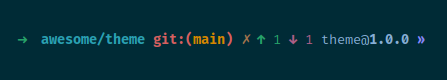

# aifrim.zsh-theme

## How to use

1. Copy the theme file to your oh-my-zsh themes directory:

    ```sh
    git clone git@github.com:aifrim/aifrim.zsh-theme.git ~/.oh-my-custom-zsh/
    ```

2. Edit your `~/.zshrc` file and set
    - `ZSH_CUSTOM="~/.oh-my-custom-zsh"`
    - `ZSH_THEME="aifrim"`.

## What you will see

If you have a `package.json`, `Cargo.toml` or `go.mod` file in your current directory, you will see the current name and version of the project:

- The current directory name and its parent
- Git
  - `git:(branch)` the git branch you are on
  - `✗` if you have uncommitted changes
  - `↓` if you fetched and have commits to pull
  - `↑` if you have commits to push
- Package version:
  - `name@1.0.0` for `package.json`
  - `name@1.0.0` for `Cargo.toml`
  - `package/name@v1` for `go.mod`

      `v1` is added when you did not define a version in your `go.mod` file, otherwise it will be the version you defined.

### Example


